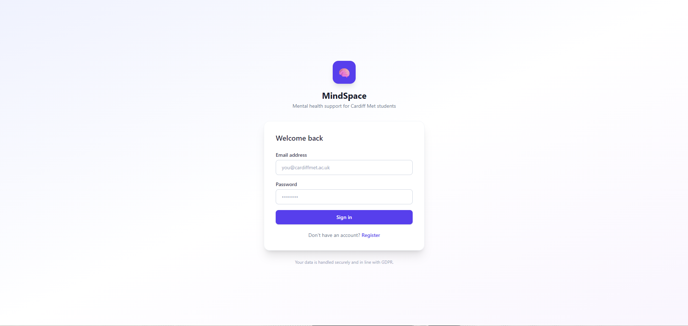
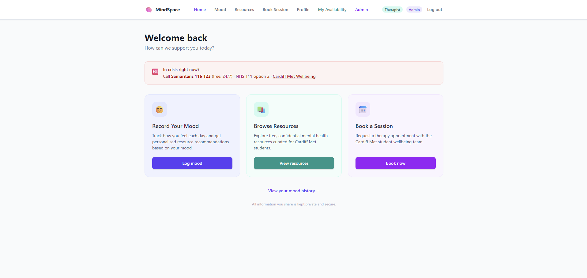
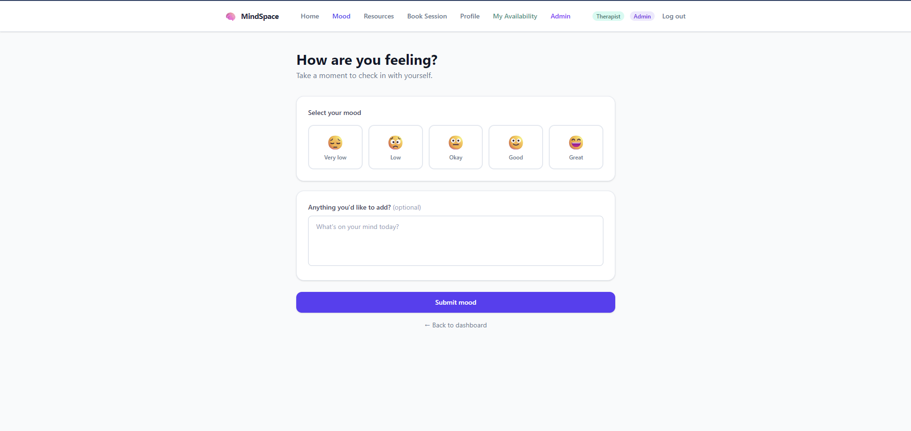
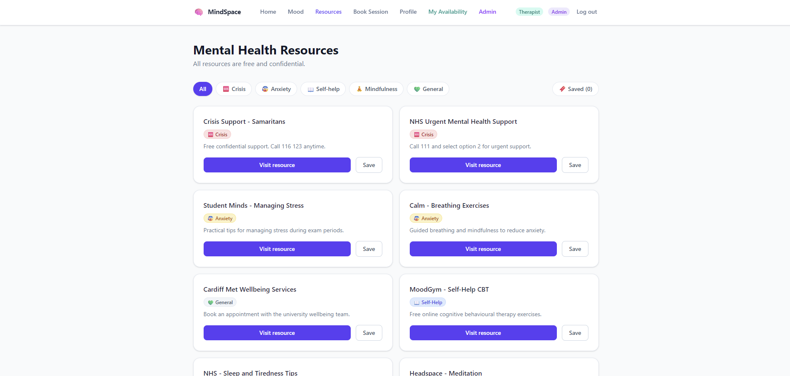
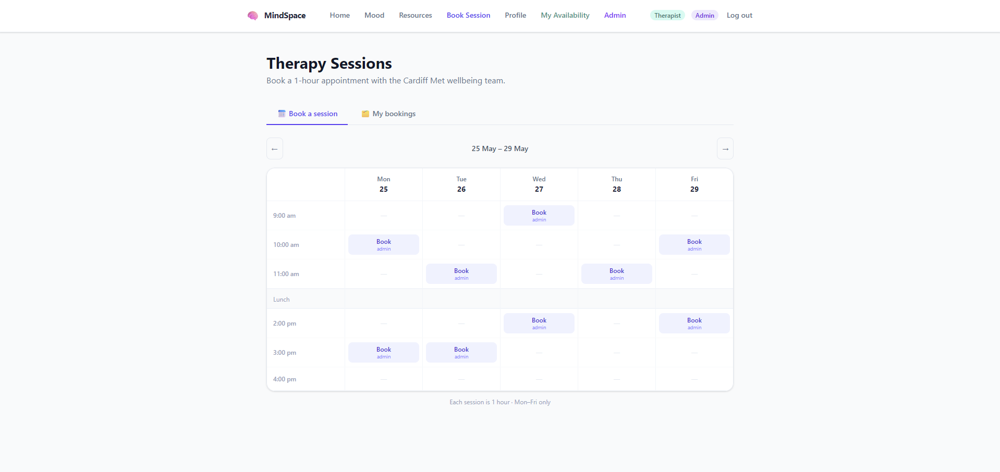
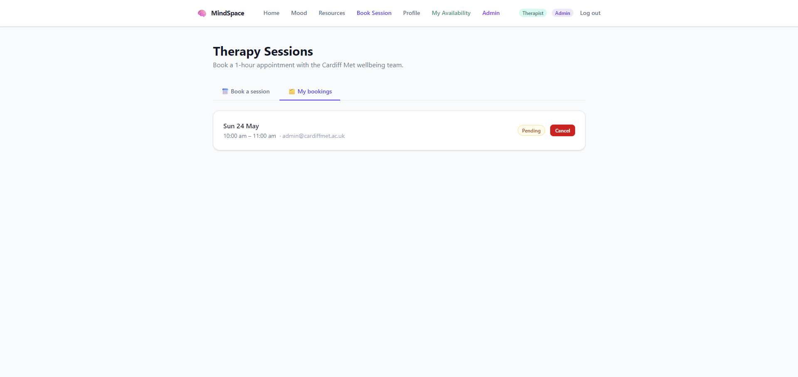

# SEN5002 – Assessment Point 1
## Workshop Week 2: Software Product Management and Prototyping
**Project:** Personalized Mental Health Support App

---

# 1. Team Details and Confirmed Roles

| Name | Student | Role |
|------|---------|------|
| Student 1 | Noe | Product Owner & DevOps Lead |
| Student 2 | Luca | QA & CI/CD Lead |
| Student 3 | Ahmed | Developer |
| Student 4 | Abdisamad | Developer |

> All team members contribute to development. Specialist roles indicate areas of primary responsibility alongside coding.

---

# 2. Product Vision (Final)

**FOR** university students studying in Cardiff
**WHO** experience stress, anxiety, or mental health challenges and need accessible support
**THE** Personalized Mental Health Support App **IS A** digital mental health support platform
**THAT** delivers personalised self-help resources, therapy session booking, and immediate chatbot support
**UNLIKE** generic mental health websites or fragmented university support systems
**OUR PRODUCT** integrates local Cardiff services with AI-driven personalisation while prioritising student privacy and data security

---

# 3. Product Management Section

## 3.1 Responsibility Map

### Product Owner & DevOps Lead (Noe)

**Weekly Responsibilities**
- Maintain and prioritise the product backlog
- Ensure alignment with product vision
- Organise sprint planning and weekly reviews
- Maintain GitHub repository and branching workflow
- Set up and maintain Docker container configuration
- Make scope decisions

**Decision Authority**
- Final decision on backlog priority and scope trade-offs
- GitHub repository structure and branching strategy
- Docker and deployment configuration

---

### QA & CI/CD Lead (Luca)

**Weekly Responsibilities**
- Set up and maintain the CI pipeline
- Ensure automated tests are written and tracked
- Conduct security checks (JWT, hashing, input validation)
- Record testing and security evidence
- Contribute to feature development

**Decision Authority**
- CI/CD pipeline configuration
- Testing strategy and tooling choices

---

### Developer (Ahmed)

**Weekly Responsibilities**
- Implement assigned features and user stories each sprint
- Write unit tests for own code
- Participate in code reviews via pull requests
- Collaborate on integration and bug fixing

**Decision Authority**
- Implementation approach for assigned tasks (in agreement with the team)

---

### Developer (Abdisamad)

**Weekly Responsibilities**
- Implement assigned features and user stories each sprint
- Write unit tests for own code
- Participate in code reviews via pull requests
- Collaborate on integration and bug fixing

**Decision Authority**
- Implementation approach for assigned tasks (in agreement with the team)

---

### Disagreement Resolution Process
1. Team discussion
2. Time-limited vote
3. Product Owner final decision if unresolved

---

## 3.2 Roadmap and Timeline (Weeks 1–10)

### Week 1
- Product Vision completed
- Initial backlog defined
- Team of 4 confirmed with roles assigned

### Week 2 (Assessment Point 1 Submission)
- Confirm roles and responsibilities
- Produce roadmap
- Create low-fidelity prototypes
- Submit combined document

### Week 3
- Convert epics into detailed user stories
- Define acceptance criteria
- Prioritise backlog

### Week 4 (Assessment Point 2 Submission)
- User stories and acceptance criteria finalised
- Features identified and prioritised (Must / Should / Could)
- Traceability from personas → scenarios → stories → features documented
- Submit requirements pack

### Week 5
- Set up GitHub repository with branching workflow
- Implement authentication API (register/login)
- Create initial database schema
- Deliver first working API endpoint

### Week 6
- Connect client to server (first end-to-end feature)
- Implement mood input feature
- Begin automated testing

### Week 7 (Assessment Point 2 Milestone)
- Implement personalised resource logic
- Docker container setup
- Configure basic CI pipeline
- Demonstrate working core features with evidence of branching and pull requests

### Week 8
- Implement therapy booking as a **request/confirmation** workflow
- Implement booking states: `Pending` → `Confirmed` / `Declined`
- Implement slot concurrency protection (prevent double booking)
- Conduct security review (JWT, hashing, validation)

### Week 9
- Apply Test-Driven Development to at least one feature
- Document functional testing
- Prepare run/deployment guide

### Week 10 (Assessment Point 3 Submission)
- Final testing and bug fixes
- Security checks
- Complete documentation
- Submit final product and report

---

## 3.3 Risks and Assumptions

### Key Risks
- Scope expansion beyond minimum usable version
- Development capacity constraints across 4 team members
- Client–server integration issues
- Security misconfiguration
- Booking conflicts due to concurrency (two students selecting same slot)
- Delays or ambiguity in external service confirmation

### Assumptions
- Users access via web browser
- PostgreSQL used for secure data storage
- JWT-based authentication implemented
- Appointment availability is managed externally by the counselling service
- The app can forward booking requests to the service (integration point)
- For MVP, confirmation may be simulated, but the booking state model remains the same

---

# 4. Product Prototype Section

## 4.1 Primary User Journey

Student logs in → records mood → receives personalised resources → requests a therapy session slot → receives confirmation details.

This represents a minimum usable version delivering core value while remaining realistic about how human services operate.

---

## 4.2 Low-Fidelity Mock-Ups (Screen Specifications)

The screen specifications below were agreed during Week 2 planning. The screenshots below each specification show the implemented screens from the final application, confirming that every planned screen was built as designed.

---

### Screen 1 – Login / Register

**Purpose:** Authenticate user securely.

**Inputs**
- Email
- Password
- Login button
- Register button

**Validation**
- Invalid email format
- Incorrect password
- Required fields

*Implemented screen:*

---

### Screen 2 – Dashboard

**Purpose:** Central user hub after login.

**Displays**
- Welcome message
- "Record Mood" button
- Recommended resources
- Booking status summary (e.g., pending/confirmed)

*Implemented screen:*

---

### Screen 3 – Mood Input

**Purpose:** Allow user to log emotional state.

**Inputs**
- Mood rating (1–5 scale)
- Optional text description
- Submit button

**Output**
- Confirmation message
- Trigger personalised recommendations

*Implemented screen:*

---

### Screen 4 – Resources Page

**Purpose:** Display tailored mental health resources.

**Displays**
- Resource title
- Short description
- Link button

*Implemented screen:*

---

### Screen 5 – Booking Calendar Page (Request-Based Booking)

**Purpose:** Allow students to request an appointment slot.

**Displays**
- Weekly / monthly calendar view
- Slots shown as "Available" (provided by service/external schedule)
- Slot selection + "Request booking" button

**Booking Logic (Option C)**
- Student selects an available slot and submits a booking request
- System creates a booking record with status `Pending`
- The selected slot is temporarily locked/held to prevent immediate double booking
- Booking details are forwarded to the counselling service's existing workflow/system
- Service responds with either:
  - `Confirmed` (appointment accepted)
  - `Declined` (slot not available / therapist unavailable / admin rejection)
- Student sees the status in-app, and if declined, is prompted to choose another slot

**Validation / Conflict Handling**
- If another student submits first, system returns:
  "This time slot is no longer available. Please select another."
- If external service declines, system returns:
  "This slot could not be confirmed. Please select another time."

---

### Screen 5 (continued) – Booking Calendar

*Implemented screen:*

---

### Screen 6 – Booking Status / Confirmation Page

**Purpose:** Make booking outcome clear and reduce anxiety.

**Displays**
- Status label: Pending / Confirmed / Declined
- If Confirmed: date/time + service location/contact notes
- If Declined: explanation text + "Choose another slot" button
- If Pending: "We will notify you when confirmed" message

*Implemented screen:*

---

## 4.3 Booking Workflow (External Confirmation Model)

Therapists do not use this application directly.

1. The student requests a time slot in the app.
2. The app records the request as `Pending` and forwards the details to the counselling service's existing scheduling workflow.
3. The counselling service confirms or declines the request using their existing systems.
4. The student's booking status updates to `Confirmed` or `Declined` inside the app.

This keeps availability management external while maintaining a realistic booking process.

---

## 4.4 Alignment Check

| Must-Have Capability | Roadmap Delivery | Prototype Representation |
|----------------------|------------------|--------------------------|
| Secure user registration | Week 5 | Login Screen |
| Personalised support | Weeks 6–7 | Mood + Resources Screens |
| Therapy booking | Week 8 | Booking Calendar + Status Screens |

---

# 5. Summary

This document forms the complete **Assessment Point 1 submission**, covering:
- Product Vision
- Product Management (roles and roadmap)
- Risks and assumptions
- Low-fidelity prototype description
- Primary user journey
- Request-based booking workflow with external confirmation

It establishes a structured Agile foundation for implementation in Weeks 5–10.
