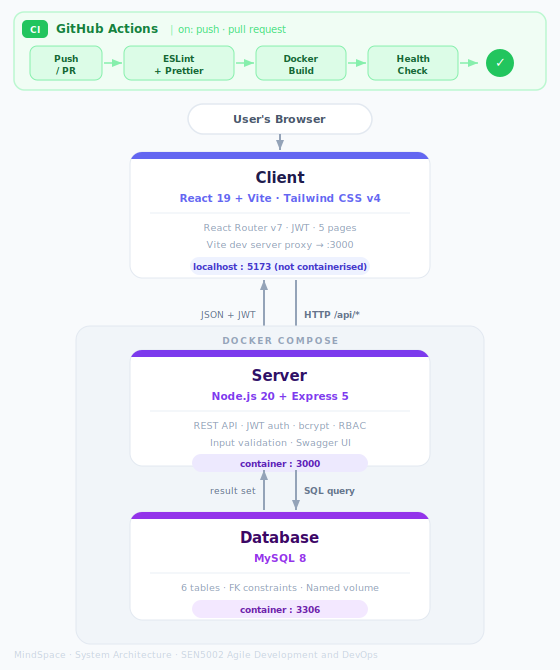

# Workshop Week 5: Architecture and Infrastructure Setup

## Assessment Point 3 — Agile and DevOps Phase (40%)

---

## 1. System Architecture

The MindSpace application follows a standard **client-server architecture** with three distinct layers: a browser-rendered frontend, a containerised REST API, and a containerised database. GitHub Actions provides continuous integration on every push.

### Architecture Diagram



### Component Responsibilities

| Component | Technology | Responsibility |
|-----------|-----------|----------------|
| **Client** | React 19 + Vite, Tailwind CSS v4, React Router v7 | Renders the user interface in the browser. Handles routing, authentication state, and API communication. Not containerised — runs on Vite's dev server (port 5173) which proxies `/api/*` requests to the server. |
| **Server** | Node.js 20 + Express 5 | Exposes a REST API at `/api/*`. Handles authentication (JWT), business logic, input validation, role-based access control, and all database interaction via parameterised queries. |
| **Database** | MySQL 8 | Persists all application data across six tables. Initialised automatically from `schema.sql` on first container start. Data survives container restarts via a named Docker volume. |
| **Docker Compose** | Docker Compose | Orchestrates the server and database containers together. Defines networking, environment variables, port mappings, and volume mounts in a single `docker-compose.yml`. |
| **GitHub Actions** | GitHub Actions CI/CD | Runs automated checks on every push and pull request: ESLint linting, Prettier formatting, Docker build verification, and container health checks. |

### Communication Flow

```
Browser
  │
  │  HTTP requests (Bearer token in Authorization header)
  ▼
React Client (Vite dev proxy → localhost:3000)
  │
  │  HTTP /api/*  (JSON responses + httpOnly refresh token cookie)
  ▼
Express Server (container port 3000)
  │
  │  SQL queries via mysql2 (parameterised)
  ▼
MySQL Database (container port 3306)
```

---

## 2. Repository Structure

The repository is hosted at **Cardiff-Met/[repo-name]** on GitHub with all four team members added as collaborators.

```
/
├── Client/                     # React + Vite frontend (SPA)
│   ├── src/
│   │   ├── pages/              # One folder per page (index.jsx)
│   │   │   ├── LoginPage/
│   │   │   ├── DashboardPage/
│   │   │   ├── MoodPage/
│   │   │   ├── ResourcesPage/
│   │   │   └── BookingPage/
│   │   ├── context/            # AuthContext, useAuth hook
│   │   ├── App.jsx             # Routes + Layout + ProtectedRoute
│   │   └── index.css           # Tailwind CSS v4 import
│   ├── vite.config.js          # Vite + Tailwind plugin + @ alias + proxy
│   └── package.json
│
├── Server/                     # Node.js + Express REST API
│   ├── src/
│   │   ├── controllers/        # authController, moodController,
│   │   │                       # resourcesController, bookingController
│   │   ├── routes/             # auth, mood, resources, booking, admin
│   │   ├── middleware/         # auth.js (JWT), requireAdmin.js
│   │   ├── utils/              # validation.js (isValidEmail etc.)
│   │   ├── db/                 # connection.js, schema.sql
│   │   └── index.js            # Express app entry point
│   ├── __tests__/              # Jest unit tests (33 tests)
│   ├── Dockerfile              # Node 20 Alpine image
│   └── package.json
│
├── docs/                       # All workshop documentation
│   ├── week01.md  –  week08.md
│   ├── architecture.svg
│   ├── Client.md
│   ├── Server.md
│   └── GithubActions.md
│
├── .github/
│   └── workflows/
│       ├── code-quality.yml    # ESLint + Prettier (Node 18 & 20)
│       └── docker-test.yml     # Docker build + container health
│
├── docker-compose.yml          # Multi-container orchestration
├── README.md                   # Setup and run guide
└── .gitignore
```

---

## 3. Dockerisation

### Server Dockerfile

Located at `Server/Dockerfile`. Uses the official Node.js 20 Alpine image to keep the image size small.

```dockerfile
FROM node:20-alpine

WORKDIR /app

COPY package*.json ./
RUN npm install

COPY . .

EXPOSE 3000

CMD ["node", "src/index.js"]
```

Key decisions:
- `COPY package*.json ./` before `COPY . .` so that Docker caches the `npm install` layer — the layer only re-runs when dependencies change, not on every code change.
- Alpine base image keeps the final image lightweight.

### Docker Compose

Located at `docker-compose.yml`. Defines two services that start together:

```yaml
services:
  db:
    image: mysql:8.0
    container_name: mental-health-db
    restart: always
    environment:
      MYSQL_ROOT_PASSWORD: root1234
      MYSQL_DATABASE: mental_health_app
    ports:
      - "3306:3306"
    volumes:
      - db_data:/var/lib/mysql
      - ./Server/src/db/schema.sql:/docker-entrypoint-initdb.d/schema.sql

  server:
    build: ./Server
    container_name: mental-health-server
    restart: always
    ports:
      - "3000:3000"
    env_file:
      - ./server/.env
    depends_on:
      - db

volumes:
  db_data:
```

The `schema.sql` file is mounted into MySQL's `docker-entrypoint-initdb.d/` directory, which causes it to run automatically on first start — creating all six tables and seeding the resources data with no manual steps.

### Build and Run Commands

**Full stack with Docker Compose (recommended):**
```bash
# Copy and fill in the environment file first
cp server/.env.example server/.env

# Start both containers (builds server image automatically)
docker compose up --build

# Server API available at:  http://localhost:3000
# API documentation at:     http://localhost:3000/api-docs
```

**Server container only:**
```bash
cd Server
docker build -t mindspace-server .
docker run --name mindspace-server-container -p 3000:3000 mindspace-server
```

**Local development (no Docker):**
```bash
# Terminal 1 — Server
cd Server && npm install && npm run dev

# Terminal 2 — Client
cd Client && npm install && npm run dev
# App available at: http://localhost:5173
```

---

## 4. GitHub Repository Setup

- **Repository:** Created under the Cardiff-Met organisation on GitHub
- **Collaborators:** All four team members (Noe, Luca, Ahmed, Abdisamad) added with write access
- **Initial commit:** `feat(init): setup server with Express, MySQL, Docker Compose, JWT auth and mood logging routes`
- **Default branch:** `main` — protected; all changes go through pull requests
- **CI/CD:** GitHub Actions workflows active from first push, visible under the Actions tab
