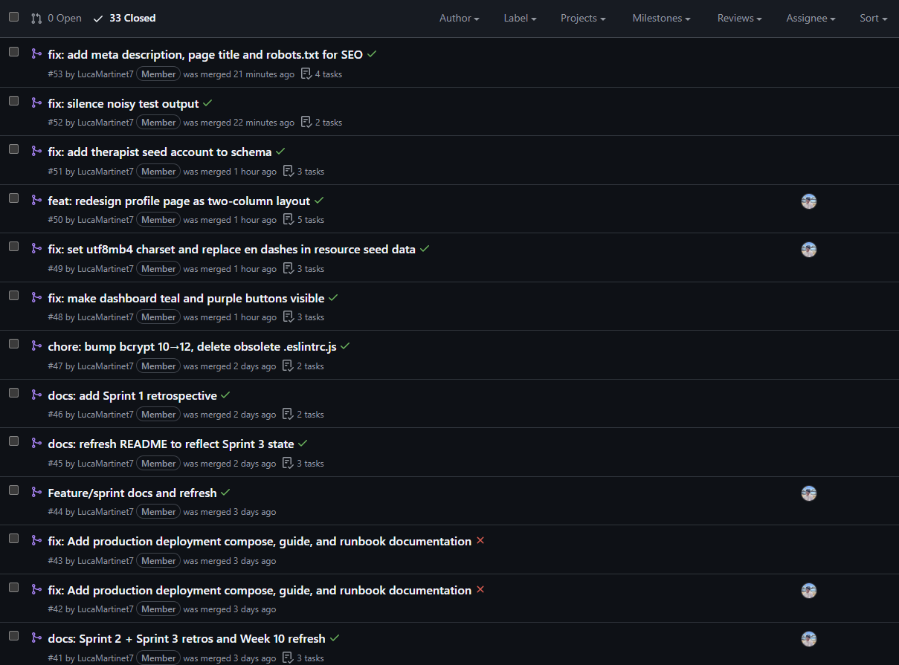
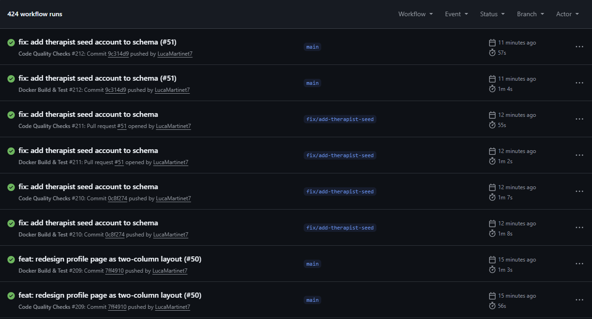
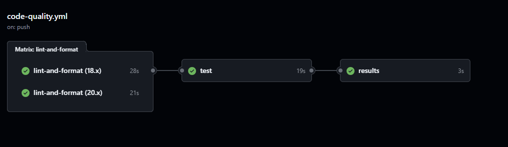
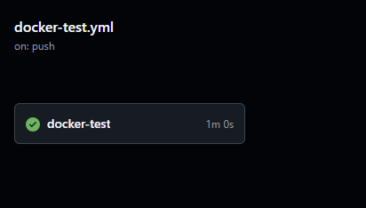

# Workshop Week 6: Scrum Planning and Collaborative Workflow

## Assessment Point 3 — Agile and DevOps Phase (40%)

---

## 1. Sprint 1 Goal

> **Deliver a working, secure end-to-end application that lets a student register, log in, track their mood, browse mental health resources, and request a therapy booking — with automatic crisis signposting when critically low mood is detected.**

Sprint 1 targets all four Must Have features (F1–F4) from the Week 4 backlog. By the end of Sprint 1, a student can open the app, create an account, log a mood, see personalised resources, book a therapy session, and be automatically directed to crisis support if their mood rating is 1.

---

## 2. Sprint 1 Backlog

Stories selected for Sprint 1 are all **Must Have** items from the Week 4 prioritised backlog.

| Story ID | User Story | Feature | Story Points | Owner |
|----------|-----------|---------|-------------|-------|
| E3 | Register with email and password | F1 | 3 | Abdisamad |
| E4 | Log in securely with JWT session | F1 | 3 | Abdisamad |
| E1 | Log mood with rating and description | F2 | 3 | Ahmed |
| E2 | Receive personalised recommendations after mood log | F2 | 2 | Ahmed |
| A1 | Browse resources without booking | F2 | 2 | Ahmed |
| D1 | Browse available therapy session slots | F3 | 2 | Abdisamad |
| D2 | Submit a booking request | F3 | 3 | Abdisamad |
| D3 | View booking status (Pending / Confirmed / Declined) | F3 | 2 | Abdisamad |
| S1 | Auto-display crisis panel when mood rating is 1 | F4 | 2 | Ahmed |
| S2 | Display emergency contact numbers on crisis panel | F4 | 1 | Ahmed |

**Total: 23 story points**

---

## 3. Task Breakdown

Each story is broken into four task types: UI, API endpoint, database, and test.

---

### F1 — Secure Authentication (Stories: E3, E4)

| Task | Type | Owner | Status |
|------|------|-------|--------|
| Create `LoginPage` component (form, validation, error display) | UI | Abdisamad | Done |
| Add registration form to `LoginPage` with toggle to login view | UI | Abdisamad | Done |
| `POST /api/auth/register` — validate, hash password, return JWT | API | Abdisamad | Done |
| `POST /api/auth/login` — authenticate, issue access + refresh token | API | Abdisamad | Done |
| `POST /api/auth/refresh` — rotate access token from httpOnly cookie | API | Abdisamad | Done |
| `POST /api/auth/logout` — clear refresh token cookie | API | Abdisamad | Done |
| Add `users` table to `schema.sql` with hashed password and role column | DB | Noe | Done |
| Unit tests: `isValidEmail`, `isValidPassword` (TDD — written first) | Test | Luca | Done |
| Unit tests: `authenticateToken` middleware (mock jwt.verify) | Test | Luca | Done |

---

### F2 — Mood Tracking and Personalised Resources (Stories: E1, E2, A1)

| Task | Type | Owner | Status |
|------|------|-------|--------|
| Create `MoodPage` — emoji mood picker (1–5), submit button, results view | UI | Ahmed | Done |
| Create `ResourcesPage` — card grid, loading state, visit/save buttons | UI | Ahmed | Done |
| `POST /api/mood` — save mood entry for authenticated user | API | Ahmed | Done |
| `GET /api/mood` — return mood history for current user | API | Ahmed | Done |
| `GET /api/resources` — return resources filtered by mood rating | API | Ahmed | Done |
| Add `mood_logs` and `resources` tables to `schema.sql` | DB | Noe | Done |
| Seed `resources` table with mental health support content | DB | Noe | Done |
| Add crisis panel component triggered when mood rating = 1 | UI | Ahmed | Done |

---

### F3 — Therapy Session Booking and Status (Stories: D1, D2, D3)

| Task | Type | Owner | Status |
|------|------|-------|--------|
| Create `BookingPage` — slot list with time-of-day filter tabs | UI | Abdisamad | Done |
| Add booking status view (Pending/Confirmed/Declined) | UI | Abdisamad | Done |
| `GET /api/booking/slots` — return available appointment slots | API | Abdisamad | Done |
| `POST /api/booking` — create booking record with status `Pending` | API | Abdisamad | Done |
| `GET /api/booking/my` — return current user's booking and status | API | Abdisamad | Done |
| Add `therapy_slots` and `bookings` tables to `schema.sql` | DB | Noe | Done |

---

### F4 — Crisis Detection and Emergency Signposting (Stories: S1, S2)

| Task | Type | Owner | Status |
|------|------|-------|--------|
| Add crisis banner to `DashboardPage` (Samaritans, NHS 111, campus line) | UI | Ahmed | Done |
| Trigger crisis panel overlay in `MoodPage` when rating = 1 | UI | Ahmed | Done |
| Ensure mood API response includes flag when rating ≤ 1 | API | Ahmed | Done |

---

### Infrastructure and CI/CD

| Task | Type | Owner | Status |
|------|------|-------|--------|
| Write `Server/Dockerfile` (Node 20 Alpine) | DevOps | Noe | Done |
| Write `docker-compose.yml` (server + db services, volumes) | DevOps | Noe | Done |
| Write `code-quality.yml` GitHub Actions workflow (ESLint + Prettier) | CI | Luca | Done |
| Write `docker-test.yml` GitHub Actions workflow (build + health check) | CI | Luca | Done |
| Configure environment variables (`.env.example`, JWT secrets) | DevOps | Noe | Done |

---

## 4. Team Roles and Owner Assignments

| Team Member | Role | Sprint 1 Responsibilities |
|-------------|------|--------------------------|
| **Noe** | DevOps Lead | Docker setup, docker-compose, schema.sql, environment variable management |
| **Luca** | QA / CI Lead | GitHub Actions pipelines, ESLint/Prettier config, Jest unit tests, code review |
| **Ahmed** | Frontend / Feature Dev | Mood tracking, resources, crisis panel — UI components and API integration |
| **Abdisamad** | Backend / Feature Dev | Authentication endpoints, booking endpoints, JWT middleware |

---

## 5. Branching Policy

The team follows a **feature branch workflow** on top of a protected `main` branch.

### Rules

1. **No direct commits to `main`** — all changes go through a pull request.
2. **Branch naming** — branches are named after the issue or feature they address (e.g. `9-implement-mvp-features-minimal-set`, `feature/admin-role`). Issue-prefixed names are preferred because GitHub automatically links the branch to its issue.
3. **One branch per feature or issue** — a branch addresses a single concern to keep PRs reviewable.
4. **Pull request required** — every branch must be merged via a PR. The PR description summarises what was changed and why.
5. **At least one review** — PRs require at least one team member to review and approve before merging.
6. **CI must pass** — both GitHub Actions workflows (`code-quality.yml` and `docker-test.yml`) must pass before a PR can be merged.
7. **Delete branch after merge** — merged branches are deleted to keep the repository clean.

### Branch Lifecycle

```
main
 └── 9-implement-mvp-features-minimal-set
       ├── (feature work committed here)
       └── PR #15 → reviewed → CI passes → merged to main
```

---

## 6. Pull Request Evidence

### PR #15 — Implement MVP Features (Minimal Set)

**Branch:** `9-implement-mvp-features-minimal-set` → `main`

**Description:** This PR delivered the full MVP: authentication (register/login/logout/refresh), mood logging, resource recommendations, therapy session booking, crisis signposting, and admin role support. All four Must Have features (F1–F4) were implemented and tested.

**Files changed:** `Server/src/controllers/`, `Server/src/routes/`, `Server/src/middleware/`, `Client/src/pages/`, `Client/src/context/`, `Server/src/db/schema.sql`

---

**Screenshot 1 — All Sprint closed PRs**

The screenshot below shows the full list of merged pull requests from Sprint 1, confirming feature branches were created, reviewed, and squash-merged into `main`.



---

**Screenshot 2 — CI checks passing (code quality pipeline)**

The screenshot below shows the `code-quality` and `docker-test` GitHub Actions workflows passing on a Sprint 1 PR, with green ticks for ESLint, Prettier, and Docker smoke test.



---

**Screenshot 3 — Code quality CI workflow detail**



---

**Screenshot 4 — Docker build CI workflow detail**



---

## 7. Daily Scrum Notes

Stand-up notes recorded at the start of each session during Sprint 1. The team used a brief text-based format shared on the group chat.

---

### Stand-up 1 — Project Kickoff

| | |
|---|---|
| **Noe** | Yesterday: Set up the GitHub repository, added all team members as collaborators, initialised the project with `npm init`. Today: Writing `docker-compose.yml` and `Server/Dockerfile`. Blocker: None. |
| **Luca** | Yesterday: Reviewed assessment brief, mapped deliverables to weeks. Today: Setting up GitHub Actions `code-quality.yml` for ESLint and Prettier. Blocker: Need to agree on ESLint config with the team. |
| **Ahmed** | Yesterday: Reviewed Week 4 backlog, identified F2 stories. Today: Starting mood logging page and `POST /api/mood` endpoint. Blocker: Need schema.sql to include `mood_logs` table before testing locally. |
| **Abdisamad** | Yesterday: Planned authentication flow (register, login, JWT). Today: Implementing `authController.js` with bcrypt and JWT. Blocker: None. |

---

### Stand-up 2 — Mid-Sprint

| | |
|---|---|
| **Noe** | Yesterday: Completed `docker-compose.yml` with server + db services and named volume. Today: Finalising `schema.sql` — adding `bookings` and `therapy_slots` tables. Blocker: Waiting for Ahmed's resource data to include in seed. |
| **Luca** | Yesterday: `code-quality.yml` is working — ESLint passes on push. Today: Adding `docker-test.yml` to verify the build and run a health check. Blocker: Need to agree on health check endpoint path. |
| **Ahmed** | Yesterday: Mood logging endpoint done; resources page rendering cards from API. Today: Connecting mood result to resources API — filtering resources by mood rating. Blocker: None. |
| **Abdisamad** | Yesterday: Register and login working with JWT access token + httpOnly refresh cookie. Today: Building booking endpoints (`GET /slots`, `POST /booking`, `GET /my`). Blocker: None. |

---

### Stand-up 3 — Sprint Close

| | |
|---|---|
| **Noe** | Yesterday: Schema complete, seed data in. Docker Compose starts cleanly end-to-end. Today: Final review of docker-test.yml health check timing. Blocker: None. |
| **Luca** | Yesterday: `docker-test.yml` passing — build + health check green. Today: Writing unit tests for validation and auth middleware; opening PR #15. Blocker: None. |
| **Ahmed** | Yesterday: Crisis panel triggering correctly on mood rating of 1, emergency contacts visible. Today: Code review on Abdisamad's booking code; final UI polish on ResourcesPage. Blocker: None. |
| **Abdisamad** | Yesterday: Booking flow complete — slot list, submit request, status view all working. Today: Code review; testing full flow end-to-end in Docker. Blocker: None. |

---

## 8. Definition of Done

A story is considered **Done** when all of the following are true:

- [ ] All acceptance criteria from Week 4 are met
- [ ] Code is committed on a feature branch (not directly on `main`)
- [ ] ESLint passes with zero errors
- [ ] Prettier formatting applied (`npm run format`)
- [ ] At least one unit test covers the new server-side logic
- [ ] All existing tests continue to pass (`npm test`)
- [ ] Both GitHub Actions workflows pass (green)
- [ ] A pull request has been opened, reviewed by at least one team member, and merged
- [ ] The feature is manually tested end-to-end in the Docker environment

---

## 9. Sprint 1 Review Summary

At the end of Sprint 1 all ten selected stories were delivered and merged to `main` via PR #15. The application runs end-to-end in Docker Compose: a student can register, log in, log a mood, view personalised resources, see the crisis panel for a rating of 1, and submit a therapy booking request.

**Velocity:** 23 story points completed in Sprint 1.

**What went well:**
- Docker and CI were set up early, so the team had a working build pipeline from day one.
- Splitting server (Abdisamad/Ahmed) and infrastructure (Noe/Luca) tracks prevented blocking.

**What to improve:**
- Admin panel stories were backlogged to Sprint 2 — they were added late and had insufficient scope definition.
- PR reviews were sometimes same-day; aim for a 24-hour review window in Sprint 2.

**Carried to Sprint 2:**
- Admin role dashboard and user management (requires `role` column and `requireAdmin` middleware — now implemented)
- Resource saving (A4 — Should Have)
- Mood trend visualisation (Could Have)
